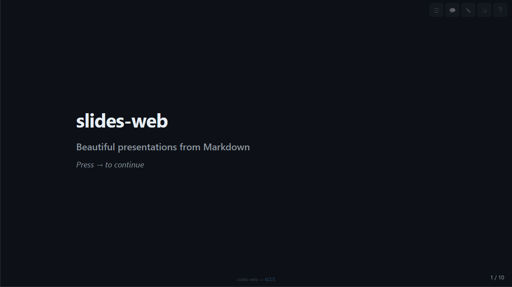

# slides-web

A web serve mode for [maaslalani/slides](https://github.com/maaslalani/slides) — browser-based presentations from Markdown.

Write your presentation in Markdown, present it in the browser with keyboard navigation, speaker notes, slide thumbnails, and PDF export.



## Features

- **Markdown-powered** — write slides in plain Markdown, separated by `---`
- **Dark mode** — elegant dark theme (#0d1117) with crisp typography
- **Keyboard navigation** — arrow keys, space, enter, backspace
- **Speaker notes** — add `<!-- notes: your notes here -->` to any slide
- **Slide thumbnails** — sidebar with quick-jump navigation
- **Progress bar** — thin accent bar at the top showing position
- **Slide counter** — current/total in the bottom corner
- **Paste mode** — paste Markdown directly into the browser
- **PDF export** — print-optimized styles via Ctrl+P
- **WebSocket sync** — multiple browser windows stay in sync
- **Responsive** — works on desktop, tablet, and mobile (swipe support)
- **Code highlighting** — syntax-colored code blocks via Pygments
- **Frontmatter** — set title and author in YAML frontmatter
- **Touch support** — swipe left/right on mobile devices
- **Fullscreen** — press F for distraction-free presenting
- **Zero dependencies on the frontend** — single HTML file, no npm, no build step

## Quick Start

```bash
# Install dependencies
pip install fastapi uvicorn markdown pygments python-multipart

# Run the server
python -m uvicorn slides_web.app:app --host 127.0.0.1 --port 8509

# Open in browser
# http://localhost:8509
```

A demo presentation loads automatically. Paste your own Markdown or use the API.

## Docker

```dockerfile
FROM python:3.12-slim
WORKDIR /app
COPY slides_web/ slides_web/
RUN pip install --no-cache-dir fastapi uvicorn markdown pygments python-multipart
EXPOSE 8509
CMD ["uvicorn", "slides_web.app:app", "--host", "0.0.0.0", "--port", "8509"]
```

```bash
docker build -t slides-web .
docker run -p 8509:8509 slides-web
```

## Keyboard Shortcuts

| Key | Action |
|-----|--------|
| `->` / `Space` / `Enter` | Next slide |
| `<-` / `Backspace` | Previous slide |
| `Home` | First slide |
| `End` | Last slide |
| `S` | Toggle slide thumbnails sidebar |
| `N` | Toggle speaker notes panel |
| `E` | Open Markdown paste editor |
| `P` | Print / Export PDF |
| `F` | Toggle fullscreen |
| `?` | Show help overlay |

## API Reference

| Method | Endpoint | Description |
|--------|----------|-------------|
| `GET` | `/` | Web presentation UI |
| `GET` | `/api/slides` | Get parsed slides as JSON |
| `POST` | `/api/load` | Load new Markdown content |
| `GET` | `/api/export/pdf` | PDF export info |
| `WS` | `/ws` | WebSocket for view sync |

### Load Markdown via API

```bash
curl -X POST http://localhost:8509/api/load \
  -H "Content-Type: application/json" \
  -d '{"content": "# Slide 1\n\nHello\n\n---\n\n# Slide 2\n\nWorld"}'
```

### Get Slides as JSON

```bash
curl http://localhost:8509/api/slides | python -m json.tool
```

## Markdown Format

Slides are separated by `---` on its own line:

```markdown
---
title: My Presentation
author: Your Name
---

# First Slide

Content here.

---

## Second Slide

- Bullet points
- **Bold text**
- `code`

<!-- notes: Speaker notes go here -->

---

## Code Example

\```python
def hello():
    print("Hello, world!")
\```
```

### Speaker Notes

Add notes with an HTML comment anywhere in the slide:

```markdown
## My Slide

Content visible to audience.

<!-- notes: These notes are only visible when you press N. -->
```

## Environment Variables

| Variable | Default | Description |
|----------|---------|-------------|
| `HOST` | `127.0.0.1` | Server bind address |
| `PORT` | `8509` | Server port |

## Screenshots

| View | Description |
|------|-------------|
|  | Main presentation view |

## Tech Stack

- **Backend:** FastAPI + Uvicorn
- **Markdown:** Python-Markdown with fenced_code, codehilite, tables
- **Syntax Highlighting:** Pygments (Monokai theme)
- **Frontend:** Vanilla JS, single HTML file, zero build tools
- **Real-time:** WebSocket for multi-window sync

---

Built by **[KCCS](https://kccsonline.com)** | Based on [maaslalani/slides](https://github.com/maaslalani/slides)
